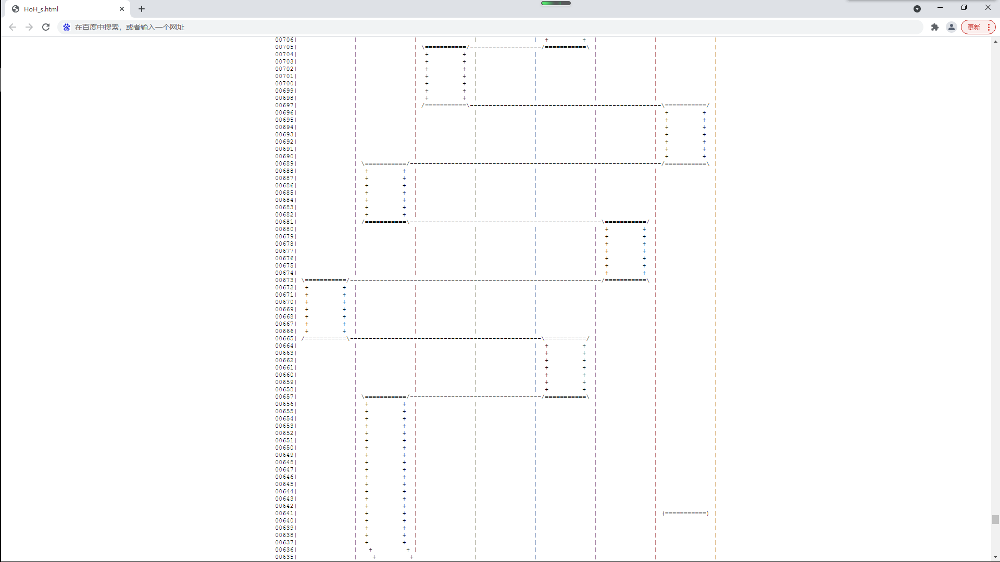

<font size = "3">

# 市ヶ谷家の倉庫
基于bestdori数据的BanDream谱面分析器！目前包含如下功能：
- [歌曲难度查询](歌曲信息（查询用）\歌曲难度表.md)
- 谱面下载（.json格式）（其实尝试用txt也是可以打开的）（前提是你看得懂）
- 若干谱面排名，包括[谱面按键数排行](歌曲信息（查询用）\按键数排行.md)、[谱面最大Combo数排行](歌曲信息（查询用）\连击排行.md)、[歌曲速度排行](歌曲信息（查询用）\速度排行.md)等
- 像素谱面模拟器


# 更新日志
<center>

|日期|内容|
|:--:|----|
|21/8/5|更新了谱面，完成了谱面更新检查主体程序|
|21/8/20|创建了代码层面的谱面类，并完成了下载功能的编写|
|21/9/5|完善了谱面类，完成了谱面模拟器的数据基础|
|21/9/14|完成了谱面静态可视化工具|
|21/9/21|完成了谱面动态可视化工具|
|21/9/22|完成了谱面可视化交互|
|22/1/13|集中更新了谱面|

</center>

# 像素谱面阅览器

市ヶ谷家の倉庫中集成了一个轻量级的`像素谱面模拟器`，它支持静态与动态预览两种模式。静态模式下，谱面将按照**由下到上**的顺序（下落顺序）呈现在网页中，可通过滚动条手动浏览，其效果如下



在动态模式下，上述谱面将按照标定速度向下滚动，其效果如下

<iframe>
src = "https://github.com/LibrarristShalinward/Ichigayas_no_Souko/附件/像素谱面模拟器-动态.html"
</iframe>

生成像素谱面需要通过运行`工具\可视化\谱面可视化.py`文件完成，其命令格式如下：

```
>>  python 工具\可视化\谱面可视化.py -h
    usage: 市ヶ谷家离线谱面模拟器交互终端 [-h] [-I ID] [-d DIFF] [-c CURVE] [-f FALLING_SPEED] [-m MODE] [-s STEP] [-r REFRESH_FREQUENCY] [-l SCREEN_RANGE] [-j USE_JAVA]

    optional arguments:
        -h, --help            
            show this help message and exit
        -I ID, --ID ID
            歌曲编号或名称
        -d DIFF, --diff DIFF
            谱面难度，默认为Ex；输入格式为格式名小写全词，即easy/normal/hard/expert/special
        -c CURVE, --curve CURVE
            新版本绿条生成插值方式，默认为线性插值-linear；另可设为三次样条插值-cubic
        -f FALLING_SPEED, --falling_speed FALLING_SPEED
            谱面纵向延伸率，默认为2；可选值为1/2/4，单位为(*64行/秒)
        -m MODE, --mode MODE
            生成像素谱面模式，默认为动态谱面-d/dynamic；另有静态模式-s/static可选
        -s STEP, --step STEP
            时间分辨率/每次刷新行数（仅支持动态谱面），默认为2；可选值为2/4/8
        -r REFRESH_FREQUENCY, --refresh_frequency REFRESH_FREQUENCY
            刷新率（仅支持动态谱面），默认为60；可选值为10/30/60
        -l SCREEN_RANGE, --screen_range SCREEN_RANGE
            屏幕显示行数（仅支持动态谱面），默认为64；可选值为16/32/64
```

命令范例

```
>>  python 工具\可视化\谱面可视化.py -I 296
>>  python 工具\可视化\谱面可视化.py -I TOMORROW
```